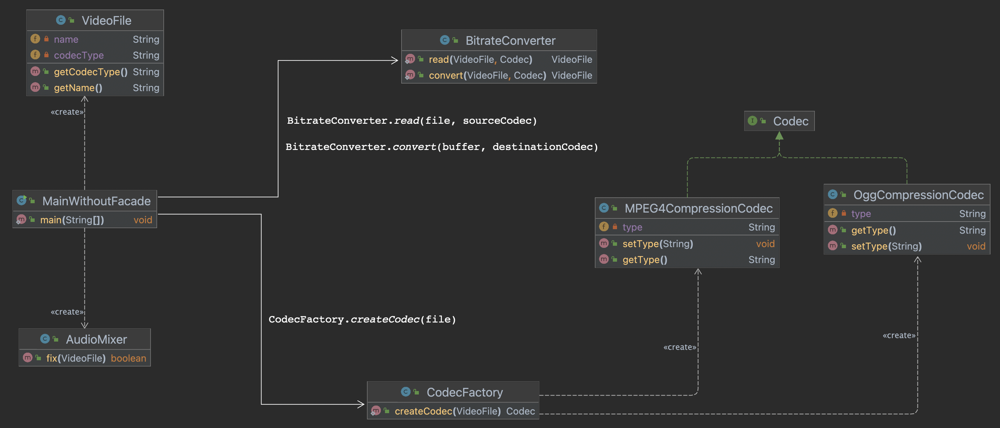

# Facade design pattern hands-on

Repository with source code to be used by the students as a starting point to the hands-on and source code with one possible solution.

## Exercise

In this exercise, the student must evolve an initial version of a software that simulates conversion between video formats. The initial version does not use the Facade design pattern. The student must create a new version that uses the pattern Facade.

In the Source_Code/Exercise folder of this repository, I provide the initial version of the software as a start point for the exercise.

## Solution

See Source_Code/Solution folder of this repository for one possible solution for the exercise.
